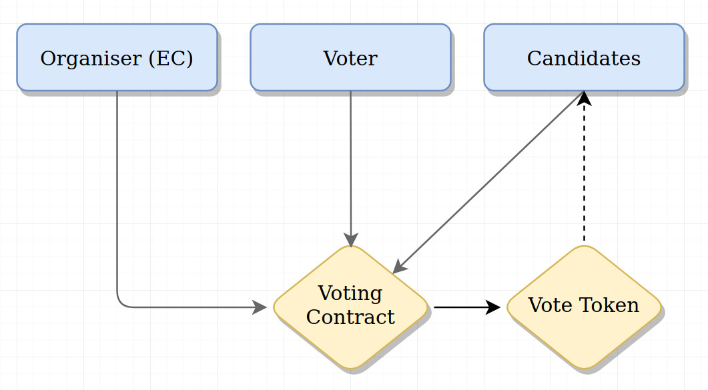

# VoteBank
Vote Bank is a fully decentralised and transparent voting system designed to scale.

### Build Instructions
1. Install Dependencies 
```
npm i
```
2. Configure truffle config and ``` truffle migrate ``` to the Matic  Test net

3. Deploy ```voterCoin.sol``` and ``` Voter.sol ``` with the ```voterCoin``` address
4.  Deploy flask dapp through virtual enviornment provided

### Architecture 


* Each actor  has seperate actions that they can perform 
* The organiser can choose to start or stop the minting of Vote Tokens as well as add to list to .
* The Canidates  can choose to link their account on the chain 
* The Voter can then cast their vote on the cannidate of their choice and the token is minted to the Canidate account 